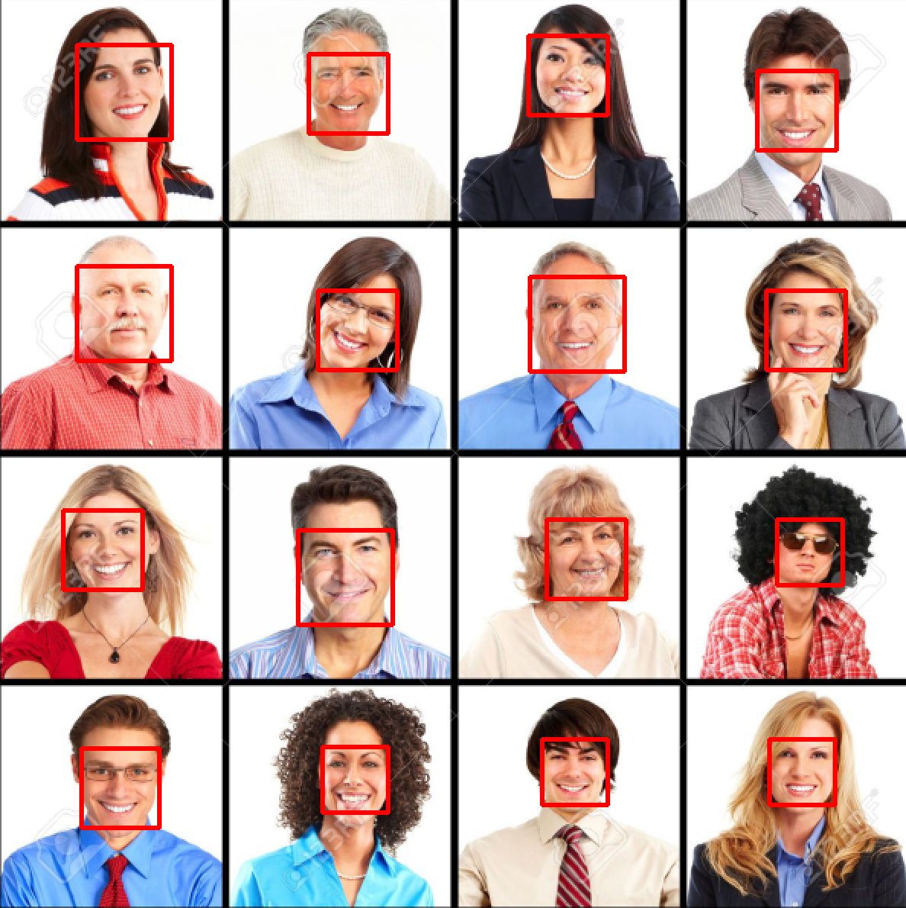
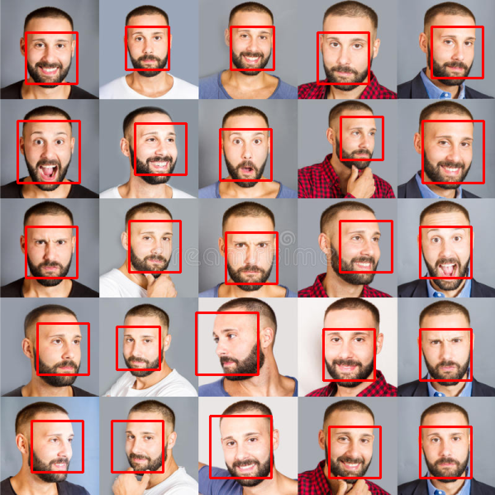
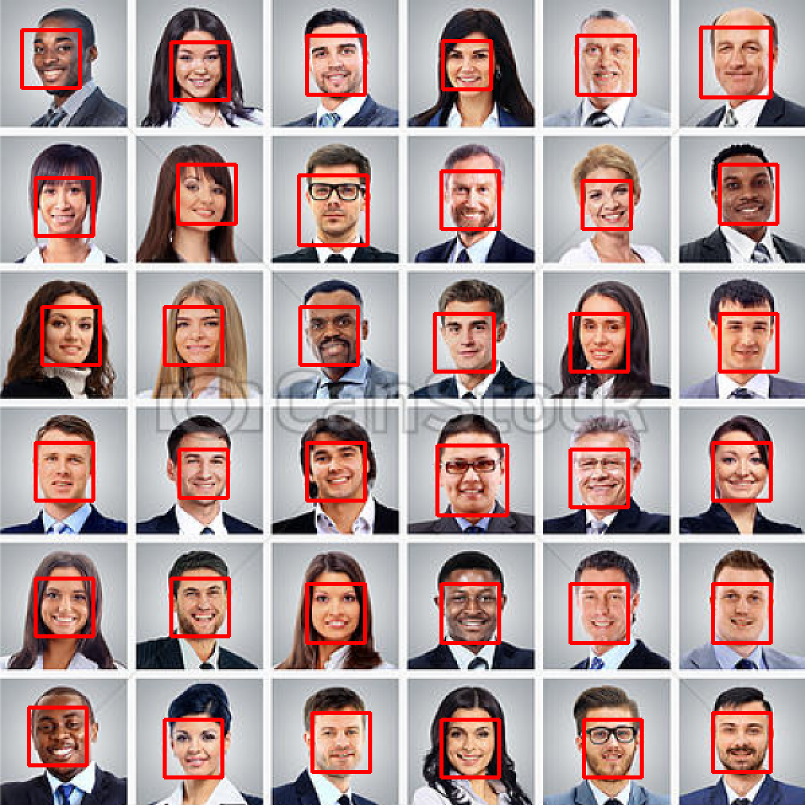
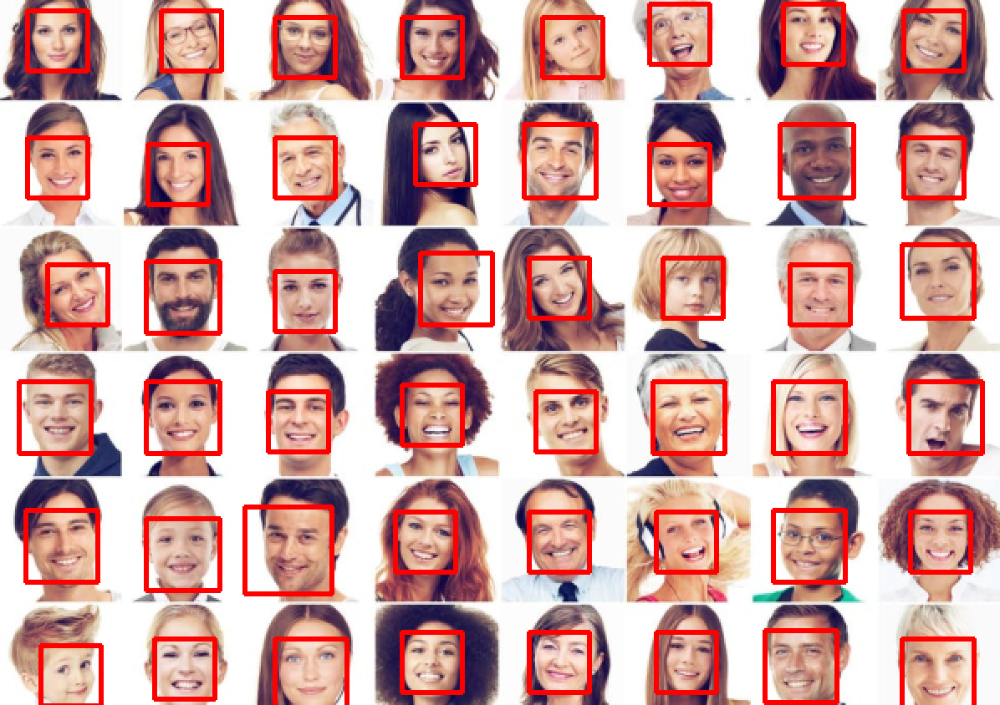
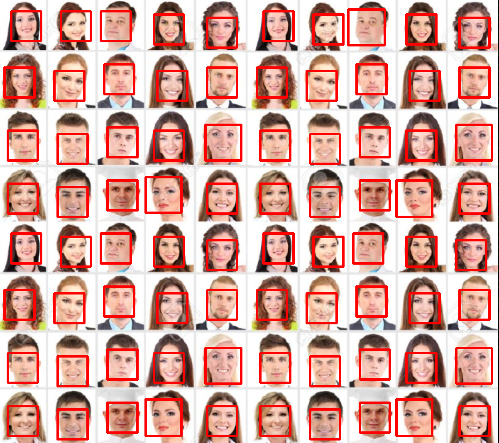

# Detectar Faces

Programa que faz a detecção de faces em imagens e vídeos.

# Descrição

Esse programa foi escrito na linguagem Python e usou as bibliotecas <a href="https://opencv.org/">OpenCV</a> e <a href="http://dlib.net/">DLib</a> como base. Ele faz a detecção da face de uma pessoa e apresenta na tela desenhando um retângulo ao redor da face. Além de mostrar a quantidade de faces encontradas. Pode ser usado para vídeo (webcam ou vídeos baixados) ou para imagens (passando o caminho para a imagem).

# Como funciona?

O programa faz a detecção da face em uma imagem/vídeo, desenha um retângulo em volta da face e apresenta a quantidade de faces presentes naquela imagem ou vídeo.

# Instalação

É preciso ter o Python instalado no seu computador (<a href="https://www.python.org/downloads/">Python</a>, recomendado baixar a última versão). Para importar algumas funções usadas nesse projeto é preciso fazer a instalação de algumas bibliotecas, são elas:

* opencv-python - Forma de instalação: <b>pip install opencv-python</b>
* imutils - Forma de instalação: <b>pip install imutils</b>
* dlib - Forma de instalação: <b>pip install dlib</b>

<b>Obs.:</b> Essas instalações podem ser feitas pelo terminal do seu computador (necessário que já tenha o python instalado) ou pelo <a href="https://www.jetbrains.com/pt-br/pycharm/download/">PyCharm</a>, se preferir.

# Uso

Após as instalações, para começar a usar basta clonar esse repositório e digitar o comando <b>python detecta-face.py</b> no terminal ou rodar pelo PyCharm.

# Exemplos

* Fazendo o reconhecimento em vídeo.

 

* Fazendo o reconhecimento em uma imagem com 16 pessoas.

 

* Fazendo o reconhecimento em uma imagem com 25 pessoas.

 

* Fazendo o reconhecimento em uma imagem com 36 pessoas.

 

* Fazendo o reconhecimento em uma imagem com 48 pessoas.

 

* Fazendo o reconhecimento em uma imagem com 80 pessoas.

